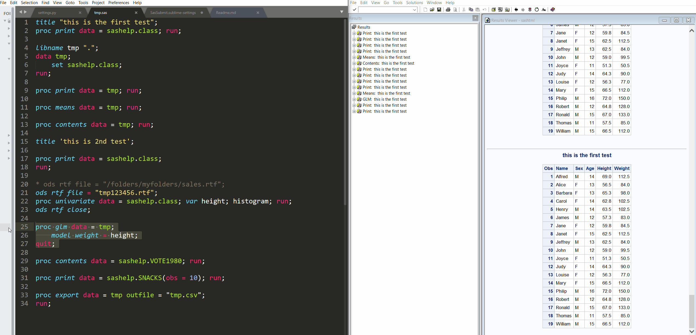
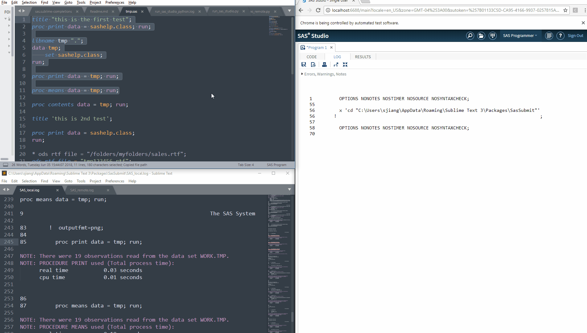
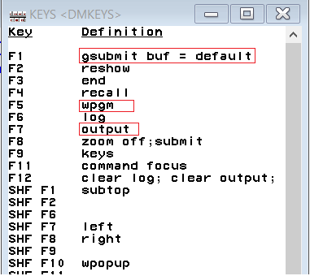

# New updates
* In this new version, instead of submiting line by line using `F3`, you can also submit a whole data or proc step by pressing `F4`!

# Descriptions
This program currently supports submitting SAS command in:
* **'classic' mode**: Running SAS program in the classic SAS window
    
* **'studio' mode**: Submitting SAS command to SAS studio running in browser
    

# Installation
Download this package and put into Sublime "packages\\" folder or install it using Sublime package control. The Sublime packge [`SAS Programming`](https://packagecontrol.io/packages/SAS%20Programming) or [`SAS Syntax and Theme`](https://packagecontrol.io/packages/SAS%20Syntax%20and%20Theme) need to be installed prior to this package.

## Basic setup
* Open the menu "Preferences/Pacakge Settings/SasSubmit/Settings". Make changes only to the user settings.

## Classic mode
* Configure SAS, this only need to be done once.
    - Change the shortcuts in SAS to be:
        + `F4`: `log; gsubmit buf = default`
    - Please follow these steps: 
        + Open SAS, in the command box in the top left of SAS program, type in `keys` and press `Enter`
        

          
        

        + This will open a "KEYS <DMKEYS>" window, make the changes.
        

          
        

## SAS studio university edition
* Start SAS studio university edition.

* Open the link [http://localhost:10080](http://localhost:10080) in your browser
* Click on the link to start SAS studio.
* The link changes to the format like "http://localhost:10080/SASStudio/371/". Change the settings `studio_address` to this link because it directly link to your SAS studio.
* Choose your preferred browser by changing the settings `browser` to be either "ie" (Internet explorer) or "firefox" (Firefox) or "chrome" (Google Chrome). 

## SAS studio
* Start SAS studio installed with SAS 9.4. It should open a page in your default browser. The link of the web page is in the format of `http://localhost:####/?sutoken=***************************************`, where `####` is a port number and `***************************************` is the token of you SAS studio. Change `studio_address` in settings to be this link.
* SAS studio do not need to be installed on your local computer. You can remotely connect to a computer running SAS studio via port forwarding.

# Usage
* Open command Platte and type in `create session`, or press `ctrl+alt+s`. 
* On the lower screen find the "Session to Create:" box, and type in the session you want to create. If you type anything else it would fail.
    -  "`classic`" stands for the traditionally used SAS program
    -  "`studio`" stands for SAS studio (or SAS University Edition)
* You can create multiple sessions for each type of session. Specifically for "classic" session, 
    - if you type "classic" in the "create session" prompt, it will create a "classic:default" session. For "classic:default" session, SasSubmit will submit SAS command to the most recently activated SAS window.
    - if you type "classic:XXXXX", where "XXXXX" is not "default", for example, "classic:project_1", it will create a named classic session, with "XXXXX" being the name, from the location of your SAS program. These types of session is not the same as "classic:default" as the pid of SAS window will be remembered in these sessions.
    - if you type "classic:" you will create a named classic session while the name is the time when you create this session. 
* Wait for the session to be created. 
* When the session is ready submit code using `F3` or `F4`.
* You can change the directory of SAS session to the location of SAS program by pressing `ctrl+alt+d`.
* You can create multiple sessions, and you can also switch to different sessions by opening command Platte and type in "choose session".
* Having too much content in SAS can make SAS running slow. In SAS you can assign the key `ALT F12` as `"log; clear; output; winclose; odsResults; clear;"`. So When you have too many results, you can press `ALT F12` in SAS to clean the results and make it running faster.

# FAQs

**Q: SAS studio is always loading using Chrome as the browser**

A: Please refer to this page https://communities.sas.com/t5/SAS-Studio/Issue-with-SAS-Studio-on-Chrome-v67/td-p/466242
